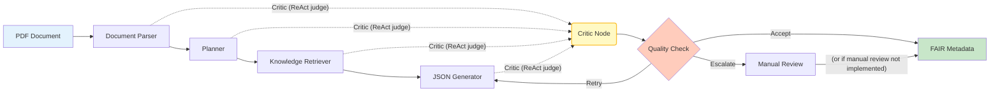

<div align="center">

# 🧬 FAIRiAgent

### *FAIR Metadata Generation Framework*

**Transform research documents into FAIR-compliant metadata with AI-powered multi-agent intelligence**

[](https://www.python.org/)
[](https://langchain-ai.github.io/langgraph/)
[](LICENSE)
[](https://fairds.systemsbiology.nl/)

[🚀 Quick Start](#-quick-start) • [📖 Documentation](#-documentation) • [🎨 Web UI](#-web-ui-features) • [🤝 Contributing](#-contributing)

**[🇨🇳 中文版 / Chinese Version](docs/README.md#-中文-chinese)** | **[🇬🇧 English](README.md)**

---

<div align="center">


**From PDF to FAIR metadata in minutes, not hours** 🚀

</div>

</div>

---

## 🎯 What is FAIRiAgent?

<div align="center">


</div>

FAIRiAgent is a **CLI-first, multi-agent framework** that automatically extracts information from research documents (PDF/text) and generates **FAIR-DS compatible JSON metadata**. Built with LangGraph and LangChain, it transforms unstructured scientific documents into standardized, machine-readable metadata that follows FAIR principles.

### 🌟 Why FAIRiAgent?

- ⚡ **Fast**: Process documents in minutes, not hours
- 🎯 **Accurate**: Multi-agent architecture with self-correcting critic loops
- 📊 **Standards-compliant**: FAIR-DS compatible output format
- 🔍 **Evidence-based**: Every field includes evidence, confidence, and provenance
- 🧠 **Intelligent**: LLM-as-Judge critic with rubric-driven quality assessment
- 🎨 **User-friendly**: Dual Web UI (Streamlit + Gradio) for interactive use
- 🔧 **Flexible**: Support for local models (Ollama) and cloud providers (OpenAI, Qwen, Anthropic)

### 📈 The Problem We Solve

Research metadata generation is **time-consuming** and **error-prone**. Scientists spend hours manually extracting metadata from papers, often missing critical fields or using inconsistent formats. 

<div align="center">

| ❌ **Before FAIRiAgent** | ✅ **With FAIRiAgent** |
|:---:|:---:|
| ⏱️ Hours of manual work | ⚡ Minutes of automated processing |
| ❌ Inconsistent formats | ✅ FAIR-DS compliant output |
| 🐛 Human errors | 🤖 AI-powered accuracy |
| 📝 Missing fields | 🔍 Comprehensive extraction |

</div>

**FAIRiAgent automates this process with:**

- 🤖 **Intelligent extraction** from complex PDF layouts
- 🧠 **Knowledge enrichment** from FAIR Data Station and ontologies  
- ✅ **Automatic validation** against schema standards
- 🔄 **Self-correction** through reflective critic loops

---

## ✨ Key Features

<div align="center">

| 🎯 **Core Capabilities** | 🚀 **Advanced Features** | 🛠️ **Developer Tools** |
|:---:|:---:|:---:|
| 🤖 Multi-Agent Architecture | 🧑‍⚖️ LLM-as-Judge Critic | 🔍 LangSmith Integration |
| 📄 PDF/Text Processing | 📈 Confidence Aggregator | 📝 JSON Line Logging |
| 🧠 Knowledge Retrieval | 🔄 Self-Correction Loops | ⚙️ Config Management |
| 🏷️ Evidence-based Fields | 🎨 Dual Web UI | 📋 Runtime Export |

</div>

### 🎯 Core Features

- 🤖 **Multi-Agent Architecture**: Specialized agents for document parsing, knowledge retrieval, and JSON generation
- 📄 **Document Processing**: Extract metadata from PDF and text documents with MinerU integration
- 🧠 **Knowledge Retrieval**: Integrate with FAIR Data Station API (59 packages, 892 terms) and local knowledge base
- 🏷️ **Evidence-based Fields**: Every field includes evidence, confidence, origin, and package source
- 📊 **JSON-only Output**: FAIR-DS compatible metadata format (no RDF/RO-Crate)
- 🎛️ **Multi-Model Support**: Ollama (local) / OpenAI / Qwen / Anthropic

### 🚀 Advanced Features

- 🧑‍⚖️ **LLM-as-Judge Critic**: Rubric-driven auditing with actionable guidance per agent
- 📈 **Confidence Aggregator**: Blends critic scores, structural coverage, and validation health
- 🔄 **Self-Correction**: Automatic retry with feedback from Critic agent
- 🎨 **Dual Web UI**: Two complete versions - Streamlit (data analysis friendly) and Gradio (API + demo friendly)
- 💬 **Real-time Streaming**: Chat-like interface with live progress updates
- ⚙️ **Configuration Management**: Save and manage runtime configurations
- 📋 **Runtime Config Export**: Automatic export of input, .env, and runtime configurations

## 🏗️ Architecture

<div align="center">


</div>

The system uses a **LangGraph-based multi-agent workflow** with intelligent self-correction:




**Workflow Flow:**

<div align="center">


</div>

**Agents & Nodes:**
1. **Document Parser**: Extracts structured information from documents
2. **Planner Node**: Summarizes document type/domain and issues special instructions
3. **Knowledge Retriever**: Enriches metadata with FAIR-DS and local knowledge (follows Planner instructions)
4. **JSON Generator**: Creates FAIR-DS compatible metadata (with Planner/Critic feedback)
5. **Critic**: Uses LLM-as-Judge rubric (see `docs/en/development/critic_rubric.yaml`) to score outputs and emit improvement ops

**Workflow Features:**
- 🔄 **Retry Logic**: Automatic retry with feedback from Critic agent
- 🎯 **Conditional Routing**: Dynamic workflow based on evaluation results
- 📊 **Execution Summary**: Track steps, retries, and outcomes
- 💾 **State Persistence**: LangGraph checkpointer for state management

## 🧑‍⚖️ LLM-as-Judge Critic & Confidence

- **Rubric location**: `docs/en/development/critic_rubric.yaml` (customizable dimensions and thresholds)
- **Key configuration** (all can be overridden via `.env`):
  - `FAIRIFIER_CRITIC_RUBRIC_PATH`
  - `FAIRIFIER_CONF_WEIGHT_CRITIC`, `FAIRIFIER_CONF_WEIGHT_STRUCTURAL`, `FAIRIFIER_CONF_WEIGHT_VALIDATION`
  - `FAIRIFIER_STRUCTURAL_COVERAGE_TARGET`, `FAIRIFIER_EVIDENCE_COVERAGE_TARGET`, `FAIRIFIER_VALIDATION_PASS_TARGET`
- **Critic output structure**:
  ```json
  {
    "score": 0.82,
    "decision": "ACCEPT|RETRY|ESCALATE",
    "issues": [...],
    "improvement_ops": [...],
    "critique": "short narrative"
  }
  ```
- `fairifier/services/confidence_aggregator.py` blends critic scores, field coverage, evidence rates, and validation results into a single confidence metric. The CLI displays four components (`critic/structural/validation/overall`) in both `processing_log.jsonl` and standard output.

## 🚀 Quick Start

### ⚡ 30-Second Setup

```bash
# 1. Clone the repository
git clone <repository-url>
cd FAIRiAgent

# 2. Install dependencies
pip install -r requirements.txt

# 3. Process your first document!
python run_fairifier.py process examples/inputs/your_document.pdf
```

### 📦 Installation

<details>
<summary><b>Click to expand detailed installation steps</b></summary>

```bash
# Clone the repository
git clone <repository-url>
cd FAIRiAgent

# Install dependencies
pip install -r requirements.txt

# Optional: Install Web UI dependencies
./install_webui_deps.sh
```

</details>

### Basic Usage

**CLI Mode:**
```bash
# Process a document
python run_fairifier.py process your_document.pdf

# Specify output directory
python run_fairifier.py process document.txt --output-dir results/

# Check configuration
python run_fairifier.py config-info
```

**Web UI Mode (Two Options Available):**

<div align="center">

| 🎨 **Streamlit UI** | 🚀 **Gradio UI** |
|:---:|:---:|
| Data analysis friendly | API + demo friendly |
| Real-time streaming output | RESTful API |
| Configuration management | Rapid prototyping |

</div>

```bash
# Option 1: Streamlit (data analysis friendly)
./start_streamlit.sh
# Access: http://localhost:8501

# Option 2: Gradio (API + demo friendly)
./start_gradio.sh
# Access: http://localhost:7860
# API docs: http://localhost:7860/docs
```

**LangGraph Studio (Development):**
```bash
# Start LangGraph dev server
langgraph dev

# Access LangGraph Studio at http://localhost:8123
```

### Configuration

**Environment Variables (.env file):**
```bash
# LLM Provider (Ollama/OpenAI/Qwen/Anthropic)
LLM_PROVIDER=ollama  # or "openai", "qwen", or "anthropic"
FAIRIFIER_LLM_MODEL=llama3  # Model name
FAIRIFIER_LLM_BASE_URL=http://localhost:11434  # For Ollama
LLM_API_KEY=your_key  # For OpenAI/Qwen/Anthropic
LLM_TEMPERATURE=0.5
LLM_MAX_TOKENS=100000
LLM_ENABLE_THINKING=false  # For Qwen models

# FAIR Data Station (optional)
FAIR_DS_API_URL=http://localhost:8083

# LangSmith (optional)
LANGSMITH_API_KEY=your_key
LANGSMITH_PROJECT=fairifier-testing
```

**Web UI Configuration:**
- Access the "⚙️ Configuration" tab in the Streamlit UI
- Configure LLM, LangSmith, and FAIR-DS settings
- Save to session or export to .env file
- Changes apply to next processing run

### Output Files

FAIRiAgent generates (in `output/<project_id>/`):
1. **`metadata_json.json`** - FAIR-DS compatible metadata
2. **`processing_log.jsonl`** - JSON line logs
3. **`llm_responses.json`** - All LLM API interactions (automatically logged, including Critic evaluations)
4. **`runtime_config.json`** - Complete runtime configuration including:
   - Input document path
   - Environment variables (.env)
   - LLM configuration
   - Runtime settings
   - Project metadata
5. **`validation_report.txt`** - Validation results (optional)

## 📊 Output Format

### FAIR-DS Compatible JSON

FAIRiAgent generates structured, evidence-based metadata in FAIR-DS compatible format:

<details>
<summary><b>📋 Click to see example output structure</b></summary>

```json
{
  "fairifier_version": "V1.0.0.20251206_rc",
  "generated_at": "2025-01-27T10:30:00",
  "document_source": "paper.pdf",
  "overall_confidence": 0.85,
  
  "metadata": [
    {
      "field_name": "project_name",
      "value": "Soil Metagenomics Study",
      "evidence": "Extracted from document title",
      "confidence": 0.95,
      "origin": "document_parser",
      "package_source": "MIMAG",
      "status": "confirmed"
    },
    {
      "field_name": "investigation_type",
      "value": "metagenome",
      "evidence": "Inferred from research domain",
      "confidence": 0.80,
      "origin": "document_parser",
      "package_source": "MIMAG",
      "status": "provisional"
    }
  ],
  
  "statistics": {
    "total_fields": 15,
    "confirmed_fields": 8,
    "provisional_fields": 7
  }
}
```

</details>

### JSON Line Logging

```json
{"timestamp": "2025-01-27T10:30:00", "level": "info", "event": "processing_started", "document_path": "paper.pdf"}
{"timestamp": "2025-01-27T10:30:05", "level": "info", "event": "field_extracted", "field_name": "project_name", "confidence": 0.95}
{"timestamp": "2025-01-27T10:30:10", "level": "info", "event": "processing_completed", "status": "completed"}
```

## 🧬 FAIR Data Station Integration

When connected to a FAIR Data Station instance, FAIRiAgent can:

- 🔍 Search for standardized terms relevant to your research
- 📦 Use community-approved metadata packages (59 packages available)
- 🏷️ Enhance fields with validated definitions
- 🌐 Ensure better interoperability

### Setup FAIR Data Station

```bash
# Download and start FAIR Data Station
wget http://download.systemsbiology.nl/unlock/fairds-latest.jar
java -jar fairds-latest.jar

# Access at http://localhost:8083
# Swagger UI: http://localhost:8083/swagger-ui/index.html
```

**Available API Endpoints:**
| Endpoint | Description |
|----------|-------------|
| `GET /api/package` | List all packages or get specific package by name |
| `GET /api/terms` | Get all terms or filter by label/definition |
| `POST /api/upload` | Validate metadata Excel file |

See [FAIR-DS API Manual](docs/en/development/FAIRDS_API_MANUAL.md) for detailed documentation.

## 🔧 Local Provisional Extensions

Add custom terms not in FAIR-DS:

```python
from fairifier.services.local_knowledge import initialize_local_kb, LocalTerm
from pathlib import Path

# Initialize local knowledge base
local_kb = initialize_local_kb(Path("kb"))

# Add custom term
local_kb.add_term(LocalTerm(
    name="custom_field",
    label="Custom Field",
    description="Project-specific metadata field",
    source="local",
    status="provisional",
    confidence=0.7
))
```

Local terms are automatically included with `source=local` and `status=provisional`.

## 📁 Project Structure

```
fairifier/
├── agents/              # Multi-agent implementations
│   ├── document_parser.py
│   ├── knowledge_retriever.py
│   ├── json_generator.py
│   ├── critic.py
│   └── orchestrator.py
├── graph/               # LangGraph workflow
│   ├── langgraph_app.py # Main LangGraph application
│   └── __dev__.py       # LangGraph Studio entry point
├── apps/                # Web UI and API
│   ├── ui/
│   │   └── streamlit_app.py  # Streamlit web interface
│   └── api/             # FastAPI (optional)
├── services/            # FAIR-DS and local knowledge
├── utils/               # Utilities
│   ├── llm_helper.py    # LLM interaction utilities
│   ├── config_saver.py # Runtime config export
│   └── json_logger.py  # JSON logging
├── cli.py               # Command-line interface
├── config.py            # Configuration management
└── models.py            # Data models

kb/                      # Knowledge base
├── local_terms.json     # Local provisional terms
├── local_packages.json  # Local packages
└── ontologies.json      # Ontology mappings

output/                  # Generated outputs
└── <project_id>/
    ├── metadata_json.json
    ├── processing_log.jsonl
    ├── llm_responses.json
    └── runtime_config.json

examples/                # Sample documents
docs/                    # Documentation
langgraph.json           # LangGraph Studio config
```

## 📈 Quality Metrics

FAIRiAgent provides **multi-dimensional confidence scoring**:

<div align="center">

| Metric | Description | Target |
|:---:|:---|:---:|
| 🧑‍⚖️ **Critic Score** | LLM-as-Judge evaluation | > 0.75 |
| 📊 **Structural Coverage** | Field completion rate | > 0.80 |
| ✅ **Validation Health** | Schema compliance | 100% |
| 📈 **Overall Confidence** | Weighted combination | > 0.80 |

</div>

**Confidence Levels:**
- 🟢 **> 0.8**: High confidence, ready to use
- 🟡 **0.5-0.8**: Good, may need minor review  
- 🔴 **< 0.5**: Requires manual review

### 📊 Example Confidence Breakdown

```
Overall Confidence: 0.85
├── Critic Score: 0.82 (weight: 0.5)
├── Structural Coverage: 0.88 (weight: 0.3)
└── Validation Health: 1.00 (weight: 0.2)
```

## 🛠️ Dependencies

Core dependencies:
- `langgraph`: Multi-agent workflow orchestration
- `langchain`: Agent framework and tools
- `langsmith`: Tracing and debugging
- `rdflib`: RDF processing (minimal use)
- `PyMuPDF`: PDF document processing
- `click`: CLI framework

## 📋 CLI Commands

```bash
# Process document
python run_fairifier.py process <document> [options]

# Start web UI
python run_fairifier.py ui

# Check status
python run_fairifier.py status <project-id>

# Show configuration
python run_fairifier.py config-info

# Validate document
python run_fairifier.py validate-document <document>
```

**Options:**
- `--output-dir, -o`: Specify output directory
- `--project-id, -p`: Custom project ID
- `--env-file, -e`: Use custom .env file
- `--json-log`: Enable JSON line logging (default: True)
- `--verbose, -v`: Show detailed processing steps

## 🎨 Web UI Features

The Streamlit web interface provides:

- 📄 **Document Upload**: Drag-and-drop or use example files
- 💬 **Real-time Streaming**: Chat-like interface showing LLM responses as they're generated
- 📊 **Live Logs**: Real-time processing logs and error display
- ⚙️ **Configuration Management**: Configure LLM, LangSmith, and FAIR-DS settings
- 🔍 **Result Review**: View and download generated metadata
- 📋 **LLM API Logs**: View all LLM interactions in formatted display

**Access the UI:**
```bash
python run_fairifier.py ui
```

Then open http://localhost:8501 in your browser.

## 🧪 Testing & Examples

### 🎯 Quick Test

```bash
# Test basic functionality (CLI)
python run_fairifier.py process examples/inputs/earthworm_4n_paper_bioRXiv.pdf

# Test with all features (FAIR-DS integration)
python run_fairifier.py process examples/inputs/earthworm_4n_paper_bioRXiv.pdf \
  --fair-ds-url http://localhost:8083

# Test web UI
python run_fairifier.py ui
# Then use the example file option in the UI
```

### 📚 Example Files

- 📄 `examples/inputs/earthworm_4n_paper_bioRXiv.pdf` - Research paper example
- 📝 More examples in `examples/inputs/` directory

### 🎬 Demo Workflow

```
1. Upload PDF → 2. Parse Document → 3. Extract Metadata 
   → 4. Enrich with Knowledge → 5. Generate JSON → 6. Validate & Review
```

**Expected Output:**
- ✅ FAIR-DS compatible JSON metadata
- 📊 Confidence scores for each field
- 🔍 Evidence traces for all extracted values
- 📋 Processing logs and LLM interactions

### LangSmith Integration

FAIRiAgent includes comprehensive LangSmith integration for debugging and monitoring:

```bash
# Set up LangSmith (get API key from https://smith.langchain.com/)
export LANGSMITH_API_KEY="your_api_key_here"
export LANGSMITH_PROJECT="fairifier-testing"

# Or configure in Streamlit UI under "⚙️ Configuration" tab
```

LangSmith provides:
- 🔍 **Trace Visualization**: Complete workflow execution flow
- 📊 **Performance Metrics**: Token usage, costs, and timing
- 🐛 **Debug Tools**: Step-by-step debugging and error analysis
- 📈 **Monitoring**: Track performance over time
- 🔗 **Trace Links**: Direct links to traces from Streamlit UI

**LangGraph Studio Integration:**
```bash
# Start LangGraph dev server
langgraph dev

# Access LangGraph Studio at http://localhost:8123
# Visualize and debug the workflow graph
```

See [LangGraph Studio Setup](docs/en/guides/LANGGRAPH_STUDIO_SETUP.md) and [LangSmith Testing Guide](docs/en/LANGSMITH_TESTING_GUIDE.md) for detailed instructions.

## 📚 Documentation

Detailed documentation is available in the [docs/](docs/README.md) directory.

- **Core**
  - [Architecture & Flow](docs/en/ARCHITECTURE_AND_FLOW.md) – High-level system architecture
  - [Evaluation Methodology](docs/en/EVALUATION_METHODOLOGY.md) – Evaluation metrics and baseline
  - [LLM Integration Guide](docs/en/LLM_INTEGRATION_GUIDE.md) – Provider configuration
  - [LangSmith Testing Guide](docs/en/LANGSMITH_TESTING_GUIDE.md) – Testing and debugging
- **Guides**
  - [LangGraph Studio Setup](docs/en/guides/LANGGRAPH_STUDIO_SETUP.md) – Local development environment
  - [Quick Start (中文)](docs/zh/guides/QUICKSTART.md) – Quick start guide in Chinese
  - [Test Guide (中文)](docs/zh/guides/TEST_GUIDE.md) – Test guide in Chinese
- **Development**
  - [FAIR-DS API Manual](docs/en/development/FAIRDS_API_MANUAL.md) – API analysis
  - [Critic Rubric](docs/en/development/critic_rubric.yaml) – Evaluation criteria
- **Web UI**
  - [Web UI Guide](fairifier/apps/README.md) – Streamlit UI features

For a complete index by language, see [docs/README.md](docs/README.md).

## 🤝 Contributing

<div align="center">

**We welcome contributions!** 🎉

</div>

This is a research tool designed for:
- 🔬 Scientific metadata standardization
- 📊 FAIR data principles implementation
- 🤖 Multi-agent system research
- 🧠 Agentic RAG development

### 🛠️ How to Contribute

1. 🍴 Fork the repository
2. 🌿 Create a feature branch (`git checkout -b feature/amazing-feature`)
3. 💾 Commit your changes (`git commit -m 'Add amazing feature'`)
4. 📤 Push to the branch (`git push origin feature/amazing-feature`)
5. 🔀 Open a Pull Request

### 📝 Areas for Contribution

- 🐛 Bug fixes and improvements
- 📚 Documentation enhancements
- 🧪 Test cases and examples
- 🌐 Additional LLM provider support
- 🎨 UI/UX improvements

## 📄 License

MIT License - Free for academic and research use.

---

<div align="center">

**🎯 FAIRiAgent V1.0.0.20251206_rc**  
*LangGraph-powered • Web UI-enabled • Standards-compliant*

[⬆ Back to Top](#-fairiagent)

---

### 🌟 Made with ❤️ for the FAIR Data Community

[](https://star-history.com/#eldermedic/FAIRiAgent_local&Date)

</div>

---

## 🔄 Recent Updates (V1.0.0.20251206_rc)

- ✅ **LangGraph Integration**: Full LangGraph workflow with state persistence
- ✅ **Streamlit Web UI**: Interactive web interface with real-time streaming
- ✅ **Chat-like Streaming**: Real-time LLM response display with chat bubbles
- ✅ **Configuration Management**: Web-based configuration with .env export
- ✅ **Runtime Config Export**: Automatic export of all runtime configurations
- ✅ **Multi-Provider Support**: Enhanced support for Ollama, OpenAI, Qwen, Anthropic
- ✅ **LangGraph Studio**: Visual workflow debugging and development
- ✅ **Improved Retry Logic**: Critic-based evaluation with automatic retry/escalation