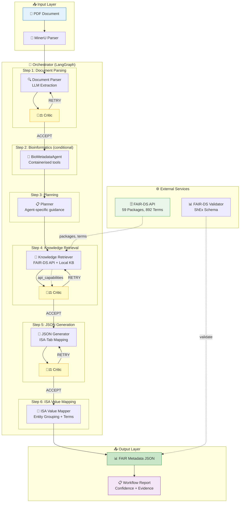

# FAIRiAgent System Architecture & Workflow

This document illustrates the detailed architecture, agent configurations, interaction flows, and developer setups for **FAIRiAgent**.

---

## 1. System Architecture Diagram

The system uses a **LangGraph-based multi-agent workflow** with API-aware evaluation and intelligent self-correction:



---

## 2. Agent & Node Breakdown

1. **Document Parser**: Extracts structured information from documents using LLM.
   - Routed to **Critic evaluation** → ACCEPT / RETRY (up to 2×)
2. **BioMetadataAgent** *(conditional)*: Recovers metadata from raw bioinformatics files (BAM, VCF, FASTQ) using Dockerised biocontainers (Samtools, Bcftools) from `quay.io/biocontainers`.
3. **Planner**: Analyzes document domain and generates per-agent guidance instructions.
4. **Knowledge Retriever**: Queries FAIR-DS API (59 packages, 892 terms) + local knowledge base.
   - Reports **API capabilities** for Critic awareness.
   - Routed to **Critic evaluation** → ACCEPT / RETRY / ESCALATE.
5. **JSON Generator**: Maps extracted info to ISA-Tab metadata.
   - **Recursive Batch Splitting**: Auto-detects truncation and splits batches (16→8→4→2→1 fields) to prevent token window overflow.
   - Routed to **Critic evaluation** → ACCEPT / RETRY.
   - **Cross-layer rollback** (ρ mechanism): JSON hard-gate failure triggers KnowledgeRetriever redo.
6. **ISA Value Mapper**: Assigns entity_id grouping, maps values to standardised ISA terms.
   - **Cardinality gate**: Skips expensive deep-agent loop when >12 entity groups to save costs.
7. **Critic Agent**: Embedded after most nodes; rubric-driven LLM-as-Judge.

---

## 3. Self-Correction & Retry Loop Logic

- **Retry Attempts**: Up to 2 retries per agent (configurable via `max_step_retries`).
- **Global Limit**: Maximum total retries across all agents (configurable via `max_global_retries`).
- **No-Progress Exit**: If the score is unchanged for 2 consecutive attempts, the workflow accepts the output with a review flag to prevent infinite loops.
- **Cross-Layer Rollback (ρ)**: A validation failure in JSON generation routes feedback back to the Knowledge Retriever rather than just retrying JSON mapping.
- **Feedback Deduplication**: Limits guidelines to 10 items per agent to prevent token accumulation.

---

## 4. State Persistence & Checkpointers

FAIRiAgent uses a checkpointer backend to persist state, enabling workflow resume.
- `none`: Stateless.
- `memory`: In-memory (dev/testing only).
- `sqlite`: Persistent SQLite database (production-ready, defaults to `output/.checkpoints.db`).

### Resource Management Snippet

```python
# Recommended for scripts using context manager
from fairifier.graph import FAIRifierLangGraphApp

with FAIRifierLangGraphApp() as workflow:
    result = await workflow.run(document_path, project_id)
    # Auto-cleanup of database connections on exit
```

---

## 5. Local Provisional Extensions

Add custom terms to local knowledge base at `kb/`:

```python
from fairifier.services.local_knowledge import initialize_local_kb, LocalTerm
from pathlib import Path

local_kb = initialize_local_kb(Path("kb"))
local_kb.add_term(LocalTerm(
    name="custom_field",
    label="Custom Field",
    description="Project-specific metadata field",
    source="local",
    status="provisional",
    confidence=0.7
))
```

---

## 6. Output Files & Formats

Outputs are saved to `output/<project_id>/`:
1. **`metadata.json`**: Standardized FAIR-DS JSON.
2. **`processing_log.jsonl`**: Real-time structured log events.
3. **`llm_responses.json`**: Complete record of all LLM requests/responses.
4. **`runtime_config.json`**: Environment and config variables used in the run.
5. **`validation_report.txt`**: Shex/validator report.

### Output JSON Schema Example

```json
{
  "fairifier_version": "V2.0.2",
  "generated_at": "2026-07-01T18:00:00",
  "document_source": "paper.pdf",
  "overall_confidence": 0.85,
  "metadata": [
    {
      "field_name": "project_name",
      "value": "Soil Metagenomics Study",
      "evidence": "Extracted from title",
      "confidence": 0.95,
      "origin": "document_parser",
      "package_source": "MIMAG",
      "status": "confirmed"
    }
  ]
}
```

---

## 7. Developer Tracing & LangSmith

To debug multi-agent trajectories, configure LangSmith:
```bash
export LANGCHAIN_TRACING_V2="true"
export LANGSMITH_API_KEY="your_api_key"
export LANGSMITH_PROJECT="fairifier-testing"
```
Or launch locally via LangGraph Studio:
```bash
langgraph dev
# Studio open at http://localhost:8123
```
