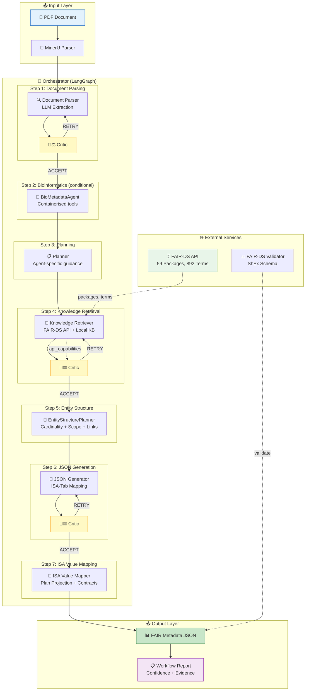

# FAIRiAgent System Architecture & Workflow

This document illustrates the detailed architecture, agent configurations, interaction flows, and developer setups for **FAIRiAgent**.

---

## 1. System Architecture Diagram

The system uses a **LangGraph-based multi-agent workflow** with API-aware evaluation and intelligent self-correction:


```mermaid
flowchart TD
    subgraph INPUT["📥 Input Layer"]
        A[📄 PDF Document]
        M[🔧 MinerU Parser]
        A --> M
    end

    subgraph ORCHESTRATOR["🎯 Orchestrator (LangGraph)"]
        direction TB

        subgraph PARSE["Step 1: Document Parsing"]
            B[🔍 Document Parser<br/>LLM Extraction]
            C1[🧑⚖️ Critic]
            B --> C1
        end

        subgraph BIO["Step 2: Bioinformatics (conditional)"]
            G[🧬 BioMetadataAgent<br/>Containerised tools]
        end

        subgraph PLAN["Step 3: Planning"]
            D[📋 Planner<br/>Agent-specific guidance]
        end

        subgraph RETRIEVE["Step 4: Knowledge Retrieval"]
            E[🧠 Knowledge Retriever<br/>FAIR-DS API + Local KB]
            C2[🧑⚖️ Critic]
            E --> C2
        end

        subgraph ENTITY["Step 5: Entity Structure"]
            E2[🧱 EntityStructurePlanner<br/>Cardinality + Scope + Links]
        end

        subgraph GENERATE["Step 6: JSON Generation"]
            F[📝 JSON Generator<br/>ISA-Tab Mapping]
            C3[🧑⚖️ Critic]
            F --> C3
        end

        subgraph MAP["Step 7: ISA Value Mapping"]
            H[🔗 ISA Value Mapper<br/>Plan Projection + Contracts]
        end
    end

    subgraph EXTERNAL["🌐 External Services"]
        API[🗄️ FAIR-DS API<br/>59 Packages, 892 Terms]
        FAIR[📊 FAIR-DS Validator<br/>ShEx Schema]
    end

    subgraph OUTPUT["📤 Output Layer"]
        J[📊 FAIR Metadata JSON]
        R[📋 Workflow Report<br/>Confidence + Evidence]
    end

    M --> B
    C1 -->|ACCEPT| G
    C1 -->|RETRY| B
    G --> D
    D --> E
    API -.->|packages, terms| E
    E -.->|api_capabilities| C2
    C2 -->|ACCEPT| E2
    C2 -->|RETRY| E
    E2 --> F
    C3 -->|ACCEPT| H
    C3 -->|RETRY| F
    H --> J
    J --> R
    FAIR -.->|validate| J

    style A fill:#e3f2fd,stroke:#1565c0
    style J fill:#c8e6c9,stroke:#2e7d32
    style C1 fill:#fff9c4,stroke:#f9a825
    style C2 fill:#fff9c4,stroke:#f9a825
    style C3 fill:#fff9c4,stroke:#f9a825
    style API fill:#e8f5e9,stroke:#43a047
    style R fill:#f3e5f5,stroke:#8e24aa
```

---

## 2. Agent & Node Breakdown

1. **Document Parser**: Extracts structured information from documents using LLM.
   - Routed to **Critic evaluation** → ACCEPT / RETRY (up to 2×)
2. **BioMetadataAgent** *(conditional)*: Recovers metadata from raw bioinformatics files (BAM, VCF, FASTQ) using Dockerised biocontainers (Samtools, Bcftools) from `quay.io/biocontainers`.
3. **Planner**: Analyzes document domain and generates per-agent guidance instructions.
4. **Knowledge Retriever**: Queries FAIR-DS API (59 packages, 892 terms) + local knowledge base.
   - Reports **API capabilities** for Critic awareness.
   - Routed to **Critic evaluation** → ACCEPT / RETRY / ESCALATE.
5. **EntityStructurePlanner**: Builds and independently audits the five-level
   entity graph, including factor cardinality, ISA scope, and unique parent
   linkage. Explicit source metadata tables can supply authoritative record
   identities through an agent-selected, deterministically validated table
   plan, avoiding false Cartesian expansion of incomplete designs. It owns row
   structure; downstream agents may not merge or invent entities.
6. **JSON Generator**: Maps extracted info to selected FAIR-DS field contracts.
   - **Recursive Batch Splitting**: Auto-detects truncation and splits batches (16→8→4→2→1 fields) to prevent token window overflow.
   - Routed to **Critic evaluation** → ACCEPT / RETRY.
   - **Cross-layer rollback** (ρ mechanism): JSON hard-gate failure triggers KnowledgeRetriever redo.
7. **ISA Value Mapper**: Projects source-backed values onto the locked entity
   graph, enforces field/value contracts and evidence scope, and compiles the
   canonical JSON/Excel matrix.
8. **Critic Agent**: Embedded after most nodes; rubric-driven LLM-as-Judge.

A workflow completion status or an LLM critic score is not, by itself, a
deliverable-quality verdict.

---

## 3. Self-Correction & Retry Loop Logic

- **Retry Attempts**: Up to 2 retries per agent (configurable via `max_step_retries`).
- **Global Limit**: Maximum total retries across all agents (configurable via `max_global_retries`).
- **No-Progress Exit**: If the score is unchanged for 2 consecutive attempts, the workflow accepts the output with a review flag to prevent infinite loops.
- **Cross-Layer Rollback (ρ)**: A validation failure in JSON generation routes feedback back to the Knowledge Retriever rather than just retrying JSON mapping.
- **Feedback Deduplication**: Limits guidelines to 10 items per agent to prevent token accumulation.

---

## 4. State Persistence & Checkpointers

FAIRiAgent uses a checkpointer backend to persist state, enabling workflow resume.
- `none`: Stateless.
- `memory`: In-memory (dev/testing only).
- `sqlite`: Persistent SQLite database (production-ready, defaults to `output/.checkpoints.db`).

### Resource Management Snippet

```python
# Recommended for scripts using context manager
from fairifier.graph import FAIRifierLangGraphApp

with FAIRifierLangGraphApp() as workflow:
    result = await workflow.run(document_path, project_id)
    # Auto-cleanup of database connections on exit
```

---

## 5. Local Provisional Extensions

Add custom terms to local knowledge base at `kb/`:

```python
from fairifier.services.local_knowledge import initialize_local_kb, LocalTerm
from pathlib import Path

local_kb = initialize_local_kb(Path("kb"))
local_kb.add_term(LocalTerm(
    name="custom_field",
    label="Custom Field",
    description="Project-specific metadata field",
    source="local",
    status="provisional",
    confidence=0.7
))
```

---

## 6. Output Files & Formats

Outputs are saved under `output/<project_id>/` and grouped by purpose:

- `deliverables/`: `metadata.json`, `isa_values.json`, and
  `metadata_fairds.xlsx`.
- `logs/`: `full_output.log`, `processing_log.jsonl`, `llm_responses.json`, and
  other execution traces.
- `reports/`: runtime configuration, validation, workflow, and auto-repair
  reports.
- `workspace/`: preserved source material and intermediate working data.

The run directory is not created until the workflow performs its first write.
Each functional subdirectory is also created lazily on its first artifact write;
an absent directory therefore means that the run produced no artifact of that
class. API request validation and project registration must complete before any
run directory is materialized. This prevents rejected or never-started requests
from leaving empty `fairifier_<timestamp>` directories.

Key artifacts include:

1. **`deliverables/metadata.json`**: Standardized FAIR-DS JSON (includes `isa_values` and
   `isa_matrix_id` when the ISA matrix compiler ran).
2. **`deliverables/isa_values.json`**: Compiled ISA columns×rows sidecar; kept in sync
   with `metadata.json.isa_values` after ISAValueMapper / AutoRepair.
3. **`logs/processing_log.jsonl`**: Real-time structured log events (including critic
   evaluations when available).
4. **`logs/llm_responses.json`**: Complete record of all LLM requests/responses.
5. **`reports/runtime_config.json`**: Environment and config variables used in the run.
6. **`reports/auto_repair_trace.json`**: Deterministic repair decisions when auto mode
   applies patches.
7. **`reports/workflow_report.json` / `reports/workflow_report.txt`**: Quality, retrieval,
   execution, and performance telemetry. The `performance` block records
   workflow wall time, per-phase agent/LLM latency, observed input/output
   tokens, configurable USD estimates, and report-only latency/token/cost
   gates. Usage or pricing that a provider does not expose is marked
   `insufficient_data` rather than estimated as zero.
8. **`validation_report.txt`**: Shex/validator report (optional).

Cost estimates use the run-specific rates configured through
`FAIRIFIER_LLM_INPUT_COST_PER_MILLION_USD`,
`FAIRIFIER_LLM_OUTPUT_COST_PER_MILLION_USD`, and optionally
`FAIRIFIER_COMPUTE_COST_PER_HOUR_USD`. A value of `-1` means unknown; use `0`
only when the endpoint is intentionally free/local. Gate thresholds use the
`FAIRIFIER_PERFORMANCE_MAX_*` settings documented in `env.example`. Gates are
diagnostic and do not change workflow completion status.

### Output JSON Schema Example

```json
{
  "fairifier_version": "V2.2.0",
  "generated_at": "2026-07-17T18:00:00",
  "document_source": "paper.pdf",
  "overall_confidence": 0.85,
  "metadata": [
    {
      "field_name": "project_name",
      "value": "Soil Metagenomics Study",
      "evidence": "Extracted from title",
      "confidence": 0.95,
      "origin": "document_parser",
      "package_source": "MIMAG",
      "status": "confirmed"
    }
  ]
}
```

---

## 7. Developer Tracing & LangSmith

To debug multi-agent trajectories, configure LangSmith:
```bash
export LANGCHAIN_TRACING_V2="true"
export LANGSMITH_API_KEY="your_api_key"
export LANGSMITH_PROJECT="fairifier-testing"
```
Or launch locally via LangGraph Studio:
```bash
langgraph dev
# Studio open at http://localhost:8123
```
