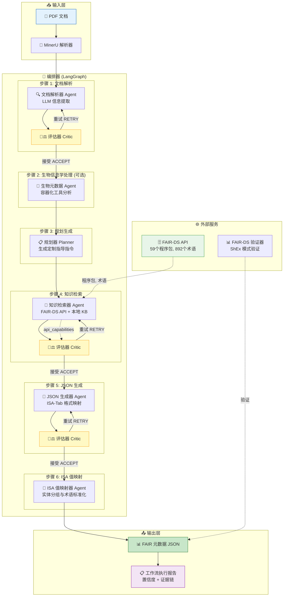

# FAIRiAgent 系统架构与工作流

本文件详细说明 **FAIRiAgent** 的系统架构、Agent 节点设计、交互逻辑以及开发者相关的配置指南。

---

## 1. 系统架构图

本系统使用基于 **LangGraph 的多 Agent 工作流**，具有感知 API 限制的评估机制与智能自我校正机制：



---

## 2. Agent 节点与模块说明

1. **文档解析器 (Document Parser)**：利用大语言模型提取研究文档中的结构化信息。
   - 连接 **Critic 评估** → ACCEPT（接受） / RETRY（最多重试2次）。
2. **生物元数据 Agent (BioMetadataAgent)** *（根据输入条件触发）*：通过 **quay.io/biocontainers** 的容器化工具（如 Samtools, Bcftools）直接从原始生物学文件（BAM, VCF, FASTQ）中补充缺失的元数据。
3. **规划器 (Planner)**：分析文档研究领域，为各个子 Agent 生成特定的提取指导原则。
4. **知识检索器 (Knowledge Retriever)**：检索 FAIR-DS API（包含 59 个程序包，892 个术语）和本地知识库。
   - 动态反馈 **API 能力限制**（如包不支持等），使 Critic 能够进行感知的多维评估。
   - 连接 **Critic 评估** → ACCEPT / RETRY / ESCALATE。
5. **JSON 生成器 (JSON Generator)**：将提取的信息映射到符合 ISA-Tab 兼容的元数据中。
   - **递归分批拆分**：在检测到生成内容被截断时，自动将字段数量进行二分拆分（16→8→4→2→1）以避免超出上下文限制。
   - 连接 **Critic 评估** → ACCEPT / RETRY。
     - **跨层回滚 (ρ 机制)**：当 JSON 硬性验证失败时，直接回滚至知识检索节点，携带反馈重新检索。
6. **ISA 值映射器 (ISA Value Mapper)**：分配 entity_id 分组并将字段值映射到标准术语中。
   - **基数门控机制 (Cardinality gate)**：当检测到实体组数量大于 12 个时，自动使用轻量级策略跳过高成本的 ReAct 循环，以节省算力成本。
7. **评估器 Agent (Critic Agent)**：在大多数关键节点之后充当 LLM-as-Judge 裁判，按照评分规则对产物进行打分。

---

## 3. 自我修正与重试逻辑

- **重试次数**：每个 Agent 最多 2 次（可通过 `.env` 中 `max_step_retries` 调整）。
- **全局重试上限**：所有 Agent 总计的最大重试次数（通过 `max_global_retries` 调整）。
- **无进展自动退出**：如果连续 2 次重试分数没有提升，工作流将接受现有输出但会打上 `review` 标签，以防止死循环。
- **反馈去重**：历史指导意见限制在 10 项以内，避免 Token 堆积。

---

## 4. 状态持久化与 Checkpointers

FAIRiAgent 提供状态持久化，允许在发生中断后继续执行。
- `none`: 无状态。
- `memory`: 仅保存在内存中（用于开发和测试）。
- `sqlite`: 写入持久的 SQLite 数据库（默认路径为 `output/.checkpoints.db`，适用于生产）。

### 资源管理 Python 代码示例

```python
from fairifier.graph import FAIRifierLangGraphApp

# 推荐在脚本中使用上下文管理器以自动释放连接
with FAIRifierLangGraphApp() as workflow:
    result = await workflow.run(document_path, project_id)
```

---

## 5. 本地临时扩展 (Provisional Extensions)

您可以通过 Python 脚本向本地知识库 (`kb/` 目录) 添加自定义术语：

```python
from fairifier.services.local_knowledge import initialize_local_kb, LocalTerm
from pathlib import Path

local_kb = initialize_local_kb(Path("kb"))
local_kb.add_term(LocalTerm(
    name="custom_field",
    label="Custom Field",
    description="项目特定的元数据字段",
    source="local",
    status="provisional",
    confidence=0.7
))
```

---

## 6. 输出文件与格式

生成的产物保存在 `output/<project_id>/` 目录下：
1. **`metadata.json`**：标准 FAIR-DS 兼容元数据。
2. **`processing_log.jsonl`**：结构化实时处理日志。
3. **`llm_responses.json`**：该次运行的所有大模型 API 交互详情。
4. **`runtime_config.json`**：该次运行的所有环境变量和运行时参数。
5. **`validation_report.txt`**：模式校验报告。

---

## 7. 开发者追踪与调试

配置 LangSmith 进行调试：
```bash
export LANGCHAIN_TRACING_V2="true"
export LANGSMITH_API_KEY="your_api_key"
export LANGSMITH_PROJECT="fairifier-testing"
```
Or launch locally via LangGraph Studio:
```bash
langgraph dev
# 访问本地 Studio 可视化界面 http://localhost:8123
```
