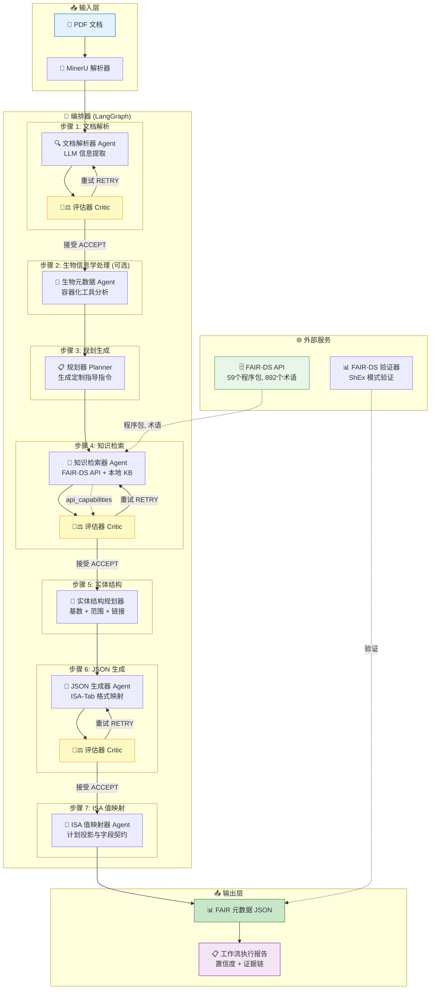

# FAIRiAgent 系统架构与工作流

本文件详细说明 **FAIRiAgent** 的系统架构、Agent 节点设计、交互逻辑以及开发者相关的配置指南。

---

## 1. 系统架构图

本系统使用基于 **LangGraph 的多 Agent 工作流**，具有感知 API 限制的评估机制与智能自我校正机制：


```mermaid
flowchart TD
    subgraph INPUT["📥 输入层"]
        A[📄 PDF 文档]
        M[🔧 MinerU 解析器]
        A --> M
    end
    
    subgraph ORCHESTRATOR["🎯 编排器 (LangGraph)"]
        direction TB
        
        subgraph PARSE["步骤 1: 文档解析"]
            B[🔍 文档解析器 Agent<br/>LLM 信息提取]
            C1[🧑⚖️ 评估器 Critic]
            B --> C1
        end
        
        subgraph BIO["步骤 2: 生物信息学处理 (可选)"]
            G[🧬 生物元数据 Agent<br/>容器化工具分析]
        end
        
        subgraph PLAN["步骤 3: 规划生成"]
            D[📋 规划器 Planner<br/>生成定制指导指令]
        end
        
        subgraph RETRIEVE["步骤 4: 知识检索"]
            E[🧠 知识检索器 Agent<br/>FAIR-DS API + 本地 KB]
            C2[🧑⚖️ 评估器 Critic]
            E --> C2
        end
        
        subgraph ENTITY["步骤 5: 实体结构"]
            E2[🧱 实体结构规划器<br/>基数 + 范围 + 链接]
        end

        subgraph GENERATE["步骤 6: JSON 生成"]
            F[📝 JSON 生成器 Agent<br/>ISA-Tab 格式映射]
            C3[🧑⚖️ 评估器 Critic]
            F --> C3
        end
        
        subgraph MAP["步骤 7: ISA 值映射"]
            H[🔗 ISA 值映射器 Agent<br/>计划投影与字段契约]
        end
    end
    
    subgraph EXTERNAL["🌐 外部服务"]
        API[🗄️ FAIR-DS API<br/>59个程序包, 892个术语]
        FAIR[📊 FAIR-DS 验证器<br/>ShEx 模式验证]
    end
    
    subgraph OUTPUT["📤 输出层"]
        J[📊 FAIR 元数据 JSON]
        R[📋 工作流执行报告<br/>置信度 + 证据链]
    end
    
    M --> B
    C1 -->|接受 ACCEPT| G
    C1 -->|重试 RETRY| B
    G --> D
    D --> E
    API -.->|程序包, 术语| E
    E -.->|api_capabilities| C2
    C2 -->|接受 ACCEPT| E2
    C2 -->|重试 RETRY| E
    E2 --> F
    C3 -->|接受 ACCEPT| H
    C3 -->|重试 RETRY| F
    H --> J
    J --> R
    FAIR -.->|验证| J
    
    style A fill:#e3f2fd,stroke:#1565c0
    style J fill:#c8e6c9,stroke:#2e7d32
    style C1 fill:#fff9c4,stroke:#f9a825
    style C2 fill:#fff9c4,stroke:#f9a825
    style C3 fill:#fff9c4,stroke:#f9a825
    style API fill:#e8f5e9,stroke:#43a047
    style R fill:#f3e5f5,stroke:#8e24aa
```

---

## 2. Agent 节点与模块说明

1. **文档解析器 (Document Parser)**：利用大语言模型提取研究文档中的结构化信息。
   - 连接 **Critic 评估** → ACCEPT（接受） / RETRY（最多重试2次）。
2. **生物元数据 Agent (BioMetadataAgent)** *（根据输入条件触发）*：通过 **quay.io/biocontainers** 的容器化工具（如 Samtools, Bcftools）直接从原始生物学文件（BAM, VCF, FASTQ）中补充缺失的元数据。
3. **规划器 (Planner)**：分析文档研究领域，为各个子 Agent 生成特定的提取指导原则。
4. **知识检索器 (Knowledge Retriever)**：检索 FAIR-DS API（包含 59 个程序包，892 个术语）和本地知识库。
   - 动态反馈 **API 能力限制**（如包不支持等），使 Critic 能够进行感知的多维评估。
   - 连接 **Critic 评估** → ACCEPT / RETRY / ESCALATE。
5. **实体结构规划器 (EntityStructurePlanner)**：在填写字段值之前建立并独立审核五级实体图，包括因子基数、ISA 范围和唯一父级链接。来源元数据表可以经代理选择、再经确定性校验的表计划提供权威记录身份，避免把不完整设计展开成错误的笛卡尔积。行结构由该节点拥有，下游代理不得合并或发明实体。
6. **JSON 生成器 (JSON Generator)**：把提取信息映射到已选中的 FAIR-DS 字段契约。
   - **递归分批拆分**：在检测到生成内容被截断时，自动将字段数量进行二分拆分（16→8→4→2→1）以避免超出上下文限制。
   - 连接 **Critic 评估** → ACCEPT / RETRY。
   - **跨层回滚 (ρ 机制)**：当 JSON 硬性验证失败时，直接回滚至知识检索节点，携带反馈重新检索。
7. **ISA 值映射器 (ISA Value Mapper)**：把有来源支持的值投影到已锁定的实体图上，执行字段与取值契约以及证据范围，并编译规范的 JSON/Excel 矩阵。实体数量不再作为跳过深度映射的阈值；基数属于结构计划。
8. **评估器 Agent (Critic Agent)**：在大多数关键节点之后充当 LLM-as-Judge 裁判，按照评分规则对产物进行打分。

工作流完成状态或 LLM Critic 分数本身并不是交付物质量结论。

---

## 3. 自我修正与重试逻辑

- **重试次数**：每个 Agent 最多 2 次（可通过 `.env` 中 `max_step_retries` 调整）。
- **全局重试上限**：所有 Agent 总计的最大重试次数（通过 `max_global_retries` 调整）。
- **无进展自动退出**：如果连续 2 次重试分数没有提升，工作流将接受现有输出但会打上 `review` 标签，以防止死循环。
- **跨层回滚 (ρ)**：JSON 生成的校验失败会把反馈送回知识检索器，而不是只重试 JSON 映射。
- **反馈去重**：历史指导意见限制在 10 项以内，避免 Token 堆积。

---

## 4. 状态持久化与 Checkpointers

FAIRiAgent 提供状态持久化，允许在发生中断后继续执行。
- `none`: 无状态。
- `memory`: 仅保存在内存中（用于开发和测试）。
- `sqlite`: 写入持久的 SQLite 数据库（默认路径为 `output/.checkpoints.db`，适用于生产）。

### 资源管理 Python 代码示例

```python
from fairifier.graph import FAIRifierLangGraphApp

# 推荐在脚本中使用上下文管理器以自动释放连接
with FAIRifierLangGraphApp() as workflow:
    result = await workflow.run(document_path, project_id)
```

---

## 5. 本地临时扩展 (Provisional Extensions)

您可以通过 Python 脚本向本地知识库 (`kb/` 目录) 添加自定义术语：

```python
from fairifier.services.local_knowledge import initialize_local_kb, LocalTerm
from pathlib import Path

local_kb = initialize_local_kb(Path("kb"))
local_kb.add_term(LocalTerm(
    name="custom_field",
    label="Custom Field",
    description="项目特定的元数据字段",
    source="local",
    status="provisional",
    confidence=0.7
))
```

---

## 6. 输出文件与格式

生成的产物保存在 `output/<project_id>/` 下，并按用途分为：

- `deliverables/`：`metadata.json`、`isa_values.json` 和
  `metadata_fairds.xlsx`。
- `logs/`：`full_output.log`、`processing_log.jsonl`、`llm_responses.json`
  及其他运行轨迹。
- `reports/`：运行配置、校验、工作流和自动修复报告。
- `workspace/`：保留的原始材料与中间工作数据。

run 根目录只在工作流第一次实际写文件时创建；四类功能子目录也只在第一次写入
对应产物时按需创建。因此目录不存在表示本次 run 没有生成这一类产物，而不是缺失
了预置结构。API 必须先通过请求配置校验并完成项目登记，之后才允许落盘，从而避免
被拒绝或未真正启动的请求遗留空的 `fairifier_<timestamp>` 目录。

主要产物：

1. **`deliverables/metadata.json`**：FAIR-DS JSON。ISA 矩阵编译完成后包含 `isa_values` 和 `isa_matrix_id`。
2. **`deliverables/isa_values.json`**：列×行形式的 ISA 旁路文件，在 ISA 值映射或自动修复之后与 `metadata.json.isa_values` 保持同步。
3. **`logs/processing_log.jsonl`**：实时结构化事件，包含可用的 Critic 评估。
4. **`logs/llm_responses.json`**：全部 LLM 请求与响应。
5. **`reports/runtime_config.json`**：本次运行使用的环境与配置。
6. **`reports/auto_repair_trace.json`**：自动模式应用补丁时的确定性修复记录。
7. **`reports/workflow_report.json` / `reports/workflow_report.txt`**：质量、检索、执行和性能遥测。`performance` 记录工作流墙钟时间、分阶段耗时、观测到的输入/输出 token、可配置的美元估算，以及仅用于报告的延迟、token 和成本门槛。提供商没有给出的用量或价格记为 `insufficient_data`，不会被当成 0。
8. **`reports/validation_report.txt`**：ShEx/校验器报告（可选）。

成本估算使用本次运行的费率：`FAIRIFIER_LLM_INPUT_COST_PER_MILLION_USD`、`FAIRIFIER_LLM_OUTPUT_COST_PER_MILLION_USD`，以及可选的 `FAIRIFIER_COMPUTE_COST_PER_HOUR_USD`。`-1` 表示未知；只有端点确实免费或本地运行时才使用 `0`。门槛变量是 `env.example` 中的 `FAIRIFIER_PERFORMANCE_MAX_*`。这些门槛只作诊断，不改变工作流完成状态。

保留的来源材料在 `workspace/source_workspace/`，不在 run 根目录。

---

## 7. 开发者追踪与调试

配置 LangSmith 进行调试：
```bash
export LANGCHAIN_TRACING_V2="true"
export LANGSMITH_API_KEY="your_api_key"
export LANGSMITH_PROJECT="fairifier-testing"
```
或者通过 LangGraph Studio 在本地启动：
```bash
langgraph dev
# 访问本地 Studio 可视化界面 http://localhost:8123
```
