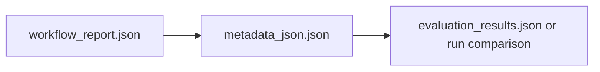

# Evaluation Analysis Framework

Comprehensive, reusable analysis framework for FAIRiAgent evaluation results.

## Current Status

This folder contains both:

- `legacy benchmark analysis` for the earlier multi-model comparison (`qwen_max`, `gpt-5.1`, `sonnet`, local Ollama models)
- `current workflow-focused result inspection` for the latest `qwen3.5-plus` runs, especially:
  - `evaluation/runs/qwen35_no_langfuse_eval_all/results/evaluation_results.json`
  - `evaluation/runs/qwen35_no_langfuse_eval_all_pubfix/results/evaluation_results.json`
  - `evaluation/runs/qwen35_pomato_publication_fix/`

Use the older figures and reports for historical comparison.
Use the latest `qwen35_*` runs when explaining the current workflow behavior.

## Quick Start For Non-Computational Users

If a user wants to understand "what happened in one run?" do **not** start from the full analysis code.
Start from one concrete example result directory.

### Recommended example

Use:

- `evaluation/runs/qwen35_pomato_publication_fix/`

This is a good tutorial example because it shows:

- a real scientific project/proposal-like document
- a difficult plant-pathology use case
- a complete workflow output
- both extracted metadata and quality summary

### Read the result in 3 steps



1. `workflow_report.json`

- Read this first to answer:
  - Did the workflow finish?
  - How many fields were extracted?
  - Which metadata packages were used?
  - Does the result need human review?

2. `metadata_json.json`

- Read this second to answer:
  - What metadata was actually generated?
  - Which values are `confirmed` vs `provisional`?
  - Which ISA levels are populated: `investigation`, `study`, `assay`, `sample`, `observationunit`?

3. `evaluation_results.json`

- Read this last when you want comparison:
  - How complete is this result against ground truth?
  - How much of the required metadata is covered?
  - Is the result structurally valid?
  - Is the updated workflow better than earlier runs?

## Example Tutorial: How To Explain One Result

### Step 1. Explain the input

This example uses `pomato`, a complex plant-pathology and project-style document.
It is harder than a standard paper because it mixes:

- project administration
- plant host information
- pathogen information
- multi-site experimental planning

### Step 2. Explain what the workflow does

Use this plain-language summary:

```text
Document in
→ identify document type and important study context
→ choose relevant metadata packages
→ generate structured metadata
→ review confidence and completeness
```

### Step 3. Show the first result summary

In `workflow_report.json`, focus on only these fields:

- `workflow_status`
- `overall_confidence`
- `metadata_overall_confidence`
- `packages_used`
- `total_fields`
- `confirmed_fields`
- `provisional_fields`

For non-computational users, interpret them as:

- `workflow_status`: whether the run finished normally
- `overall_confidence`: overall trust in the run
- `metadata_overall_confidence`: trust in the extracted metadata values
- `packages_used`: which metadata templates/checklists were chosen
- `confirmed/provisional`: which values are likely strong vs still need human checking

### Step 4. Show the metadata itself

Then open `metadata_json.json` and inspect it in this order:

1. `investigation`
2. `study`
3. `assay`
4. `sample`
5. `observationunit`

This is the easiest way for non-computational users to understand the result because it follows a research logic:

- project
- study
- measurement
- sample
- unit/site/context

### Step 5. Explain why evaluation matters

Use `evaluation_results.json` only after showing the result itself.

The most useful metrics for non-technical explanation are:

- `required_completeness`: how much of the must-have metadata was captured
- `overall_completeness`: how much of all expected metadata was captured
- `schema_compliance_rate`: whether the output structure is valid
- `overall_score`: overall quality judgment

### Step 6. Use before/after comparison

For a simple tutorial narrative, compare:

- `evaluation/runs/qwen35_no_langfuse_eval_all/results/evaluation_results.json`
- `evaluation/runs/qwen35_no_langfuse_eval_all_pubfix/results/evaluation_results.json`

This shows that the newer workflow improved:

- aggregate score
- completeness
- required-field coverage
- schema compliance

That comparison is easier for users to understand than model-family benchmarking.

## Recommended Reading Paths

### For a user who wants to understand one result

1. `evaluation/runs/qwen35_pomato_publication_fix/workflow_report.json`
2. `evaluation/runs/qwen35_pomato_publication_fix/metadata_json.json`
3. `evaluation/runs/qwen35_no_langfuse_eval_all_pubfix/results/evaluation_results.json`

### For a user who wants historical benchmark context

1. `evaluation/reports/FINAL_EVALUATION_RESULTS.md`
2. `evaluation/analysis/key_figures/evaluation_summary.png`
3. `evaluation/analysis/key_figures/field_analysis_report.png`

## Architecture

The analysis framework is designed to be:
- **Generic**: Automatically discovers models and documents
- **Extensible**: Easy to add new metrics and visualizations
- **Maintainable**: Clear separation of concerns

### Directory Structure

```
evaluation/analysis/
├── __init__.py
├── config.py                    # Configuration (exclusions, mappings)
├── baseline_comparison.py        # Baseline data loading and processing
├── run_analysis.py              # Main entry point
├── data_loaders/
│   └── evaluation_loader.py    # Discovers and loads evaluation results
├── analyzers/
│   ├── model_performance.py     # Model performance metrics
│   ├── workflow_reliability.py  # Workflow reliability analysis
│   ├── failure_patterns.py      # Failure pattern analysis
│   └── pass_at_k.py             # Pass@k metrics (SWE-agent style)
├── visualizations/
│   ├── model_comparison.py      # Model comparison charts
│   ├── workflow_reliability.py  # Reliability visualizations
│   ├── failure_analysis.py      # Failure analysis charts
│   └── baseline_comparison.py   # Baseline vs agentic comparisons
└── reports/
    └── report_generator.py      # Orchestrates all analysis
```

## Usage

### Basic Usage

```bash
# Run full analysis
python evaluation/analysis/run_analysis.py

# Custom output directory
python evaluation/analysis/run_analysis.py --output-dir results/

# Filter specific runs
python evaluation/analysis/run_analysis.py --pattern "qwen_*"
```

### Configuration

Edit `evaluation/analysis/config.py` to:
- Exclude specific models or documents
- Map model name variants to canonical names
- Configure display names and colors
- Normalize document IDs

### Adding New Models

The framework automatically discovers new models. Just:
1. Add new runs to `evaluation/runs/`
2. Run analysis - new models will be included automatically
3. Optionally add display name/color in `config.py`

### Adding New Documents

Similarly, new documents are auto-discovered:
1. Add new document runs
2. Run analysis - new documents will be included
3. Optionally normalize document IDs in `config.py` if needed

## Output Structure

```
evaluation/analysis/output/
├── figures/                      # All visualization PNG files
├── tables/                       # CSV and LaTeX tables
│   ├── model_rankings.csv/tex
│   ├── reliability_summary.csv/tex
│   ├── agent_reliability.csv/tex
│   ├── failure_by_agent.csv/tex
│   ├── pass_at_k_lenient.csv/tex   # Pass@k with lenient criteria
│   ├── pass_at_k_moderate.csv/tex  # Pass@k with moderate criteria
│   ├── pass_at_k_strict.csv/tex    # Pass@k with strict criteria
│   ├── pass_at_k_by_document.csv   # Pass@k breakdown by document
│   └── pass_at_k_multi_criteria.csv # Comparison across criteria
├── data/                         # Processed data (CSV)
│   ├── model_performance.csv
│   ├── document_performance.csv
│   ├── workflow_reliability.csv
│   └── pass_at_k_report.json       # Full pass@k analysis report
└── analysis_summary.json         # Summary statistics
```

## Key Features

### Automatic Discovery
- Discovers all models from run directories
- Discovers all documents from evaluation results
- Merges runs from same model (handles reruns automatically)

### Baseline Comparison
- Automatically detects baseline runs (directories starting with `baseline_`)
- Compares baseline vs agentic workflows
- Generates per-document and overall comparisons

### Pass@k Analysis
- Similar to SWE-agent benchmark metrics
- Calculates probability of success in k attempts
- Configurable success criteria with presets:
  - `basic`: Any output
  - `lenient`: Minimal quality
  - `moderate`: Recommended default
  - `strict`: High quality
  - `very_strict`: Publication-ready
- Generates tables: `pass_at_k_*.csv`, `pass_at_k_*.tex`
- Multi-criteria comparison across presets

### Model Name Normalization
- Merges variant names (e.g., `gpt5` + `openai_gpt5` → `GPT-5`)
- Configurable via `MODEL_MERGE_MAP` in `config.py`

### Document ID Normalization
- Handles different document IDs between baseline and agentic
- Configurable via `DOC_ID_MAP` in `config.py`

## Extending the Framework

### Adding New Metrics

1. Add metric calculation to appropriate analyzer in `analyzers/`
2. Update `ReportGenerator` to include new metric
3. Add visualization if needed in `visualizations/`

### Adding New Visualizations

1. Create new visualization class in `visualizations/`
2. Add to `ReportGenerator._generate_*_visualizations()`
3. Export from `visualizations/__init__.py`

## Configuration Reference

### Exclusion Lists

```python
EXCLUDED_MODELS = ['opus', 'anthropic_opus']  # Models to skip
EXCLUDED_DOCUMENTS = ['biorem']  # Documents to skip
EXCLUDED_DIRECTORIES = ['archive']  # Directories to skip
```

### Model Configuration

```python
MODEL_MERGE_MAP = {
    'openai_gpt5': 'gpt5',  # Merge variants
    'anthropic_sonnet': 'sonnet',
}

MODEL_DISPLAY_NAMES = {
    'gpt5': 'GPT-5',  # Human-readable names
}

MODEL_COLORS = {
    'gpt5': '#27ae60',  # Visualization colors
}
```

### Document Configuration

```python
DOC_ID_MAP = {
    'aec8570': 'biosensor',  # Normalize document IDs
}
```

## Notes

- The framework automatically handles reruns by merging data from same model
- Baseline runs are detected by directory name prefix (`baseline_*`)
- All exclusions and mappings are configurable in `config.py`
- The framework is designed to work with any number of models/documents
